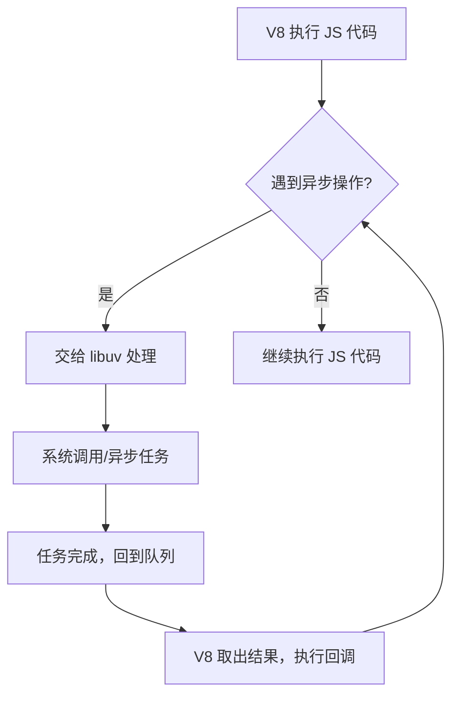

## 中间层

1. 由于不同操作系统的底层调用机制存在差异，为了实现跨平台，需要有一个中间层程序来屏蔽这些底层差异，并向上层提供统一的 API 接口。
2. 在 Node.js 中，这一中间层由用 C 语言编写的异步 I/O 库 —— libuv 实现。
   - 这里的 I/O（输入/输出）指的是程序与外部世界之间进行数据交换的操作。
   - 例如：程序将数据写入文件、打印日志、发送网络请求，或者从文件中读取数据、接收网络数据、获取用户输入等，这些都属于 I/O 操作。
3. 因此，Node.js 能够实现跨平台运行，并且为开发者提供了统一的 API 调用方式。


## 动态链接库

动态链接库（Dynamic Link Library，简称 **DLL**）是一种包含可被多个程序同时调用的代码和数据的文件。它的主要特点如下：

- **按需加载**：DLL 文件不会在程序编译时直接包含到可执行文件（如 `.exe`）中，而是在程序运行时根据需要加载。
- **代码共享**：多个应用程序可以共享同一个 DLL 文件中的功能，无需为每个程序重复编写相同的代码。

在不同操作系统下，动态链接库的文件扩展名各不相同：

- Windows：`.dll` 「 Dynamic Link Library 」
- Linux：`.so` 「 Shared Object 」
- macOS：`.dylib` 「 Dynamic Library 」

动态链接库本质上就是编译型程序之间的公共代码库，可在运行时动态引入，实现功能扩展。


## Node Bindings

Node Bindings 通常指的是通过 C++ 编写的 Node.js 扩展模块，其相关说明如下：

- 这些扩展模块会被编译为以 `.node` 为后缀的二进制文件。
- 本质上，它们是 Node.js 的功能扩展模块，可以通过 `require` 语句在 Node.js 中按需加载。
- 由于 V8 引擎本身是用 C++ 实现的，因此 Node.js 可以在运行时通过这些扩展模块扩展自身功能，直接调用底层 C++ 代码。

通过 Node Bindings，可以让 Node.js 程序高效调用底层系统能力或已有的 C/C++ 库，实现更多高级功能。

 


## 事件循环

与浏览器类似，Node.js 的底层同样依赖事件循环（Event Loop）来处理异步逻辑。而在 Node.js 内部，libuv 作为核心库，也是通过事件循环机制来管理系统调用的。因此，在 Node.js 中，实际上存在着两层事件循环。

### 具体的执行流程如下：

1. **V8 解析 JavaScript 代码**，当遇到异步操作时（如定时器、I/O 操作等）；
2. **V8 通过 Node Bindings**，利用扩展能力，将异步任务交由 libuv，添加到其事件队列中；
3. **libuv 在自己的事件循环中**，检测并执行这些异步操作，进行相应的系统调用；
4. **系统调用完成后**，libuv 会将结果放入已完成队列；
5. **在 Node.js 的事件循环周期中**，V8 会检查是否有已完成的异步任务；
6. **如果有已完成的任务**，则取出结果并执行对应的回调函数；
7. **整个流程不断循环**，直到所有任务处理完毕。

```shell
+---------------------+
|  V8 执行 JS 代码    |
+----------+----------+
           |
           v
+---------------------+
| 遇到异步操作        |
+----------+----------+
           |
           v
+---------------------+
| 交给 libuv 处理     |
+----------+----------+
           |
           v
+---------------------+
| 系统调用/异步任务   |
+----------+----------+
           |
           v
+---------------------+
| 任务完成，回到队列  |
+----------+----------+
           |
           v
+---------------------+
| V8 取出结果，执行回调|
+----------+----------+
           |
           v
      (循环往复)
```




